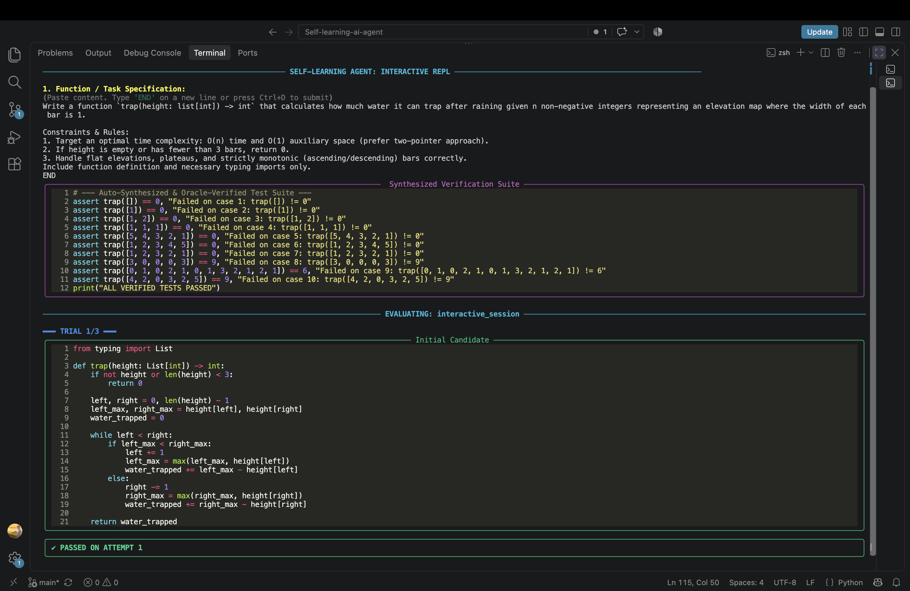
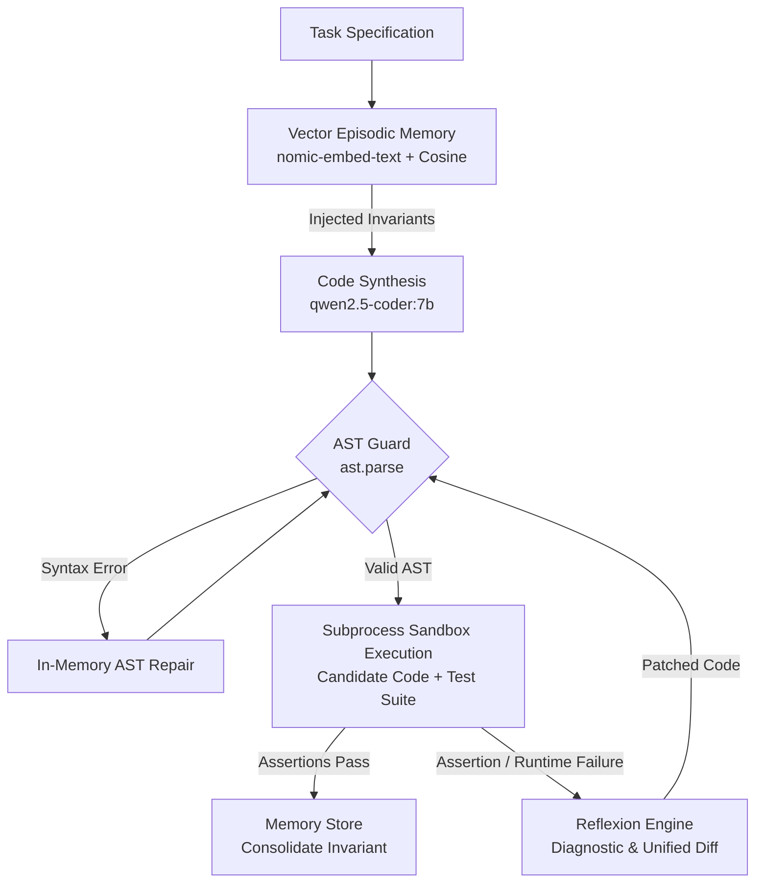

# Self-Learning Autonomous Python Coding Agent

An autonomous, self-learning Python coding agent that implements recursive reflection (*Reflexion*), zero-cost AST pre-validation, vector-indexed episodic memory, and oracle-driven test synthesis. Built to run locally via Ollama with local open-weights models (`qwen2.5-coder:7b` and `nomic-embed-text`).

<p align="center">
  
</p>

<p align="center">
  
  
  
  
</p>

---

## Key Capabilities

- **Reflexion-Based Repair Loop:** Intercepts runtime exceptions, assertion errors, and execution tracebacks in an isolated sandbox, automatically diagnosing root causes and synthesizing precise code patches.
- **AST Pre-Validation Guard:** Employs Python's abstract syntax tree (`ast.parse`) to detect syntax errors, dangling quotes, and unclosed delimiters prior to subprocess invocation—repairing syntax in-memory without consuming execution attempts.
- **Dense Vector Episodic Memory:** Stores distilled algorithmic heuristics and invariants using `nomic-embed-text` embeddings. Retrieves contextually relevant lessons via cosine similarity to prevent regression and enable zero-shot cross-task transfer.
- **Automated Oracle Test Synthesis:** Eliminates LLM mental arithmetic hallucinations by generating simple brute-force reference implementations, evaluating test cases at runtime in a Python sandbox, and emitting 100% mathematically verified assertion suites.
- **Developer Terminal UI (TUI):** Built with `rich`, featuring dynamic status spinners, Monokai syntax-highlighted code blocks, error telemetry cards, and colorized unified patch diffs.
- **Interactive REPL:** Solve ad-hoc algorithmic tasks interactively with manual or auto-synthesized test suites.

---

## System Architecture




---

## Project Structure

```
.
├── agent/
│   ├── benchmark.py       # Standardized evaluation benchmark suite
│   ├── executor.py        # Subprocess execution sandbox with timeout safety
│   ├── llm.py             # Ollama API client & code block parsing utilities
│   ├── memory.py          # Vector episodic memory (embeddings, similarity, consolidation)
│   ├── reflector.py       # Failure diagnosis and patch synthesis engine
│   ├── tester.py          # Dual-model oracle test case synthesizer
│   ├── ui.py              # Rich TUI formatting (spinners, panels, unified diffs)
│   └── validator.py       # AST pre-validation and syntax repair guard
├── main.py                # Pipeline orchestrator and interactive REPL entrypoint
├── test_generalization.py # Cross-task zero-shot transfer verification script
├── agent_memory.json      # Persistent vector-indexed heuristic store
├── requirements.txt       # Project dependencies
└── README.md

```

---

## Prerequisites

1. **Python 3.10+**
2. **Ollama** installed and running locally:
```bash
ollama serve
```

3. Pull the required models:
```bash
ollama pull qwen2.5-coder:7b
ollama pull nomic-embed-text

```


---

## Installation

1. Clone the repository:
```bash
git clone [https://github.com/](https://github.com/)<your-username>/Self-learning-ai-agent.git
cd Self-learning-ai-agent

```


2. Set up a virtual environment:
```bash
python3 -m venv .venv
source .venv/bin/activate

```


3. Install dependencies:
```bash
pip install -r requirements.txt

```


---

## Usage

### 1. Run the Evaluation Benchmark

Evaluates the agent across standard algorithmic tasks to verify memory recall, AST validation, and self-repair:

```bash
python main.py

```

### 2. Interactive REPL Mode (Manual Assertions)

Provide custom problem specifications and your own test harnesses:

```bash
python main.py --interactive

```

*(Paste your input and type `END` on a new line or press `Ctrl+D` to submit each section)*

### 3. Interactive Mode with Automated Test Synthesis

Provide only the task specification; the agent generates a reference oracle and produces verified test assertions automatically:

```bash
python main.py --interactive --auto-test

```

### 4. Verify Cross-Task Generalization

Test whether heuristics learned in previous tasks transfer zero-shot to unseen problems with distinct signatures:

```bash
python test_generalization.py

```

---

## Technical Highlights

* **Anti-Task-Anchoring:** Stored heuristics are generalized invariant statements rather than task-specific assertions, ensuring vector embeddings match cleanly across distinct problem domains.
* **Memory Consolidation:** Automatically merges overlapping lessons when cosine similarity exceeds threshold ranges, keeping the episodic memory compact and high-signal.
* **Oracle-Verified Test Cases:** Avoids arithmetic hallucinations by running a naive reference function against diverse input tuples in Python before constructing assertions.

---

## 📄 License

MIT License [LICENSE](LICENSE). Free to use, adapt, and build upon.